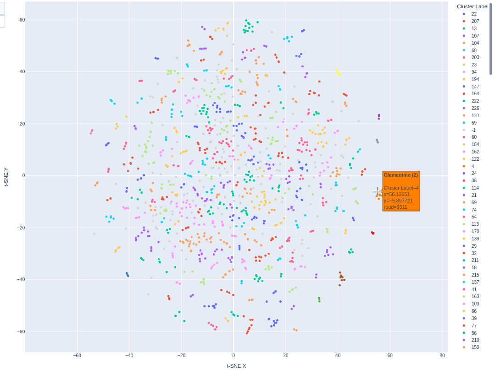

# Folk Song Classification and Roud Index Number Prediction
## Background
English-language folk songs can't be identified by name alone, their lyrics vary over space and time space and time, and influence each other's content. The Roud Folk Song Index number has become the standard for grouping together different versions of the same song. Steve Roud began indexing in the 1970s, and is still indexing as of 2023. 

I wanted to see if an ensemble of machine learning algorithms that could match his skill. Given the lyrics, would it choose the same groupings of songs, where the line between "same" and "different" is fuzzy? Could it help with future indexing?

## Example lyrics clustering
 

Examining the clusters' Roud numbers in the t-SNE space shows good results, even with lyrics clusters of varying shapes and densities.

## Steps, tools and sources
* Data sources: Ballad Index and Digitrad (Mudcat) databases, in defunct formats
* Exploration: Jupyter Notebooks
* Extraction and transformation: Regex and custom Python functions
* Embeddings: instructor-large via huggingface/SentenceTransformer
* Dimensionality reduction: t-SNE model from Scikit-Learn
* Soft clustering: HDBSCAN module by McInnes, Healy & Astels
* Visualisation: plotly.express
* ...Probabilistic classification, web deployment: TBC
